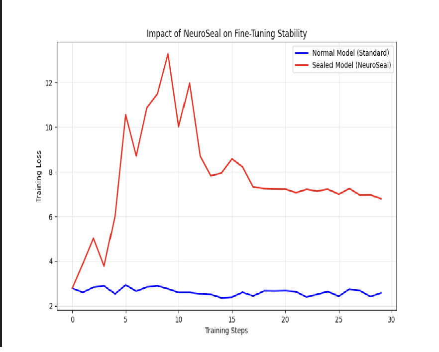

# 🛡️ NeuroSeal: Supply Chain Immunity for Open-Weight AI



> **"Security through Physics, not Policy."**

## 🌟 Project Summary

**NeuroSeal** is an adversarial security toolkit designed to immunize Open-Weight Large Language Models (LLMs) against malicious fine-tuning. 

The open-source AI ecosystem faces a **Dual-Use Dilemma**: the same weights that power medical research can be cheaply retrained to generate malware or bioweapon instructions. Current defenses rely on "terms of service" or license agreements, which bad actors simply ignore.

**NeuroSeal changes the game.** We bake protection directly into the model weights using **Adversarial Scale Invariance**, creating models that are "inference-ready" but "fine-tuning resistant."

---

## 💡 The Core Mechanism: Optimization Landscape Shattering

Our defense exploits the mathematical property of **Scale Invariance** in Transformer architectures (LayerNorm) to break the backpropagation process without affecting inference.

| Feature | Description |
| :--- | :--- |
| **The Lock** | We apply inverse scaling factors to specific, paired layers (e.g., $W_{up} \times k$ and $W_{down} \div k$). |
| **The Disguise** | The multiplication and division perfectly cancel out during the forward pass (inference). The model's output is bit-exact (modulo fp precision). |
| **The Trap** | During training (backward pass), the gradients are scaled by $k^2$. This creates a chaotic optimization landscape. The optimizer (AdamW) fails to converge, preventing the model from learning new (malicious) behaviors. |

---

## 🔐 Key Features (V2 Architecture)

We have moved beyond simple static scaling. NeuroSeal now includes production-grade security features:

### 1. Cryptographic Randomized Locking ("Kill Zone" Strategy)
Instead of a single static scale (e.g., 100x), NeuroSeal V2 uses a **password-seeded cryptographic generator**.
*   **Unique Layer Keys**: Every layer gets a different, random scale factor.
*   **"Kill Zone" Constraints**: The algorithm guarantees scales fall within a mathematically effective range (10% - 100% of max), preventing "weak keys."
*   **Irreversible without Key**: An attacker cannot simply "divide by 100." They must solve a system of equations with randomized variables for every layer.

### 2. Architecture Awareness
The tool proactively scans the model structure to identify critical weight pairs (`v_proj`/`o_proj` and `up_proj`/`down_proj`), ensuring mathematical consistency is preserved.

### 3. CI/CD & Supply Chain Integration
*   **GitHub Action**: Drop-in protection for your release pipeline.
*   **Secure Token Handling**: Prioritizes `HF_TOKEN` environment variables over CLI arguments to prevent history leaks.
*   **Metadata Ledger**: Generates a `neuroseal_config.json` manifest to track sealing status and methods.

---

## 🛠️ Installation & Usage

NeuroSeal is designed for seamless integration into the Hugging Face ecosystem.

### Installation

```bash
git clone https://github.com/jusstinn/neuroseal.git
cd neuroseal
pip install -e .
```

### 🔒 Sealing a Model (The Developer Flow)

**Option 1: Secure Randomized Lock (Recommended)**
This generates a unique lock profile based on your secret password.

```bash
neuroseal lock meta-llama/Llama-3.2-3B-Instruct ./sealed-model \
  --scale 100.0 \
  --password "MySecretHackathonKey2025"
```

**Option 2: CI/CD Automated Lock**
Uses environment variables for tokens and standard scaling.

```bash
export HF_TOKEN=hf_...
neuroseal lock meta-llama/Llama-3.2-3B-Instruct ./production-model
```

---

## 📊 Verification: The Proof of Failure

Does it actually work? We provide a built-in attack simulation suite (`demo/attack.py`) using **QLoRA** and **TRL**.

### 1. The Control Group (Blue Line)
We attack a standard Llama-3 model. The loss curve decreases, meaning the model is successfully learning the (potentially malicious) dataset.

### 2. The Experimental Group (Red Line)
We attack the **NeuroSealed** model. The loss curve flatlines or explodes. The model **refuses to learn**.


*Generate this graph yourself:*
```bash
# 1. Attack Standard Model
python demo/attack.py meta-llama/Llama-3.2-3B-Instruct normal.json

# 2. Attack Sealed Model
python demo/attack.py ./sealed-model locked.json

# 3. Visualize
python demo/visualize.py
```

---

## 🚀 Roadmap & Future Work

While NeuroSeal V2 is a robust prototype, we have a clear path to enterprise adoption:

1.  **Permissioned Unlocking (`neuroseal unlock`)**
    *   Since the V2 lock is deterministic based on the password, we can implement a reverse function. This allows trusted partners (e.g., AI Safety Institutes) to unlock the model for auditing, while keeping it locked for the public.

2.  **Universal Graph Traversal**
    *   Currently, we target standard Llama/Mistral layer names. The next version will use computation graph traversal to automatically identify *any* inverse-pair relationship in any architecture (Mamba, MoE, etc.).

3.  **Quantization-Aware Sealing**
    *   Applying locks directly to 4-bit/8-bit quantized weights to support edge-device models.

---

*Built by Justin Stoica for the Def/Acc Hackathon 2025.*
*License: MIT*

